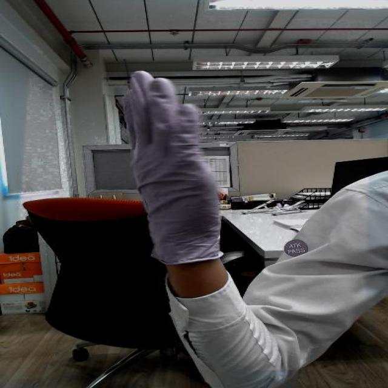
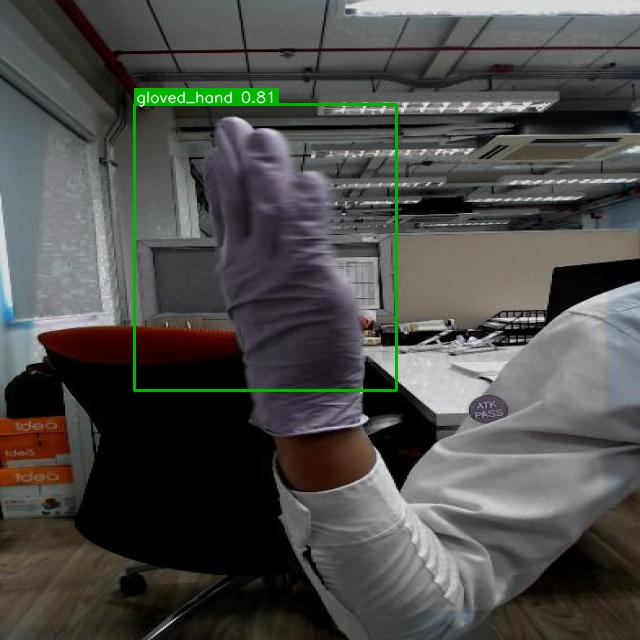
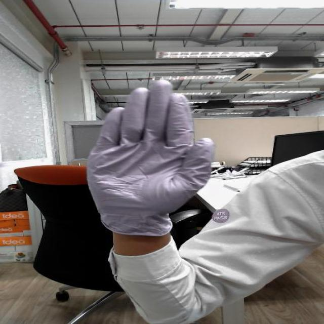
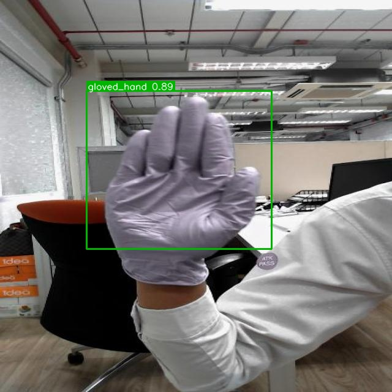
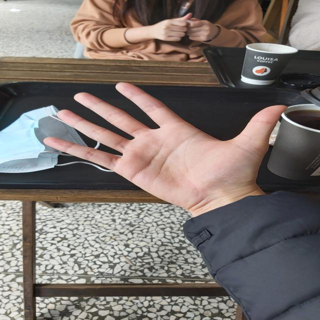
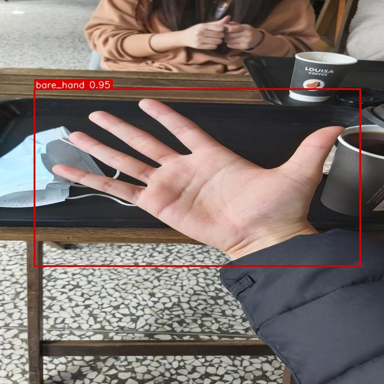
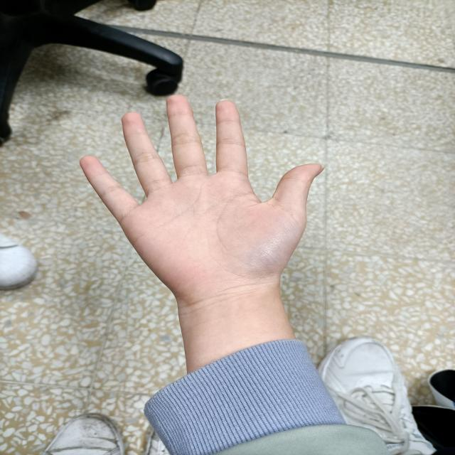
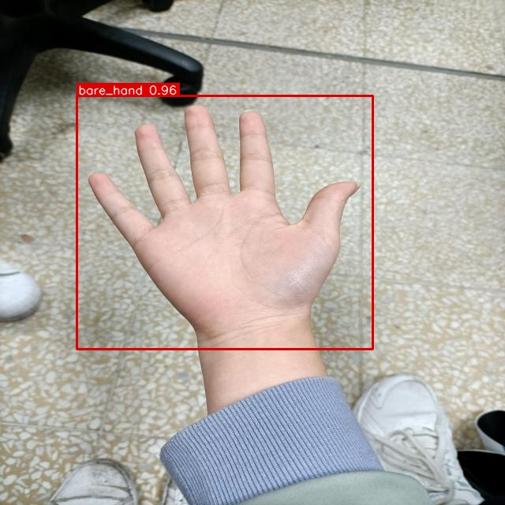
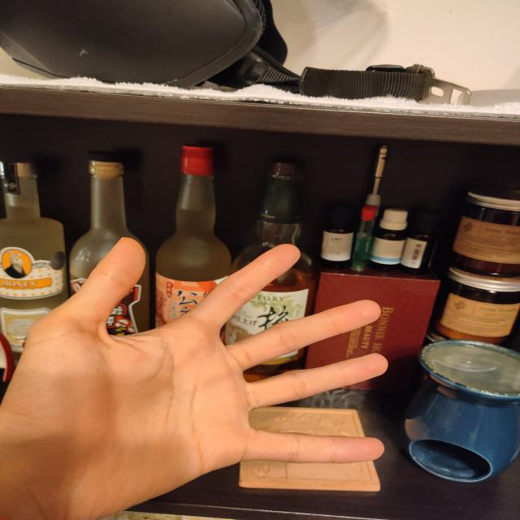

# Part 2 — Gloved vs Bare Hand Detection (C++)

A C++ port of the Part 1 Python pipeline: loads the ONNX-exported model with
[ONNX Runtime](https://onnxruntime.ai/), runs inference with
[OpenCV](https://opencv.org/) for image I/O and preprocessing, and reproduces the
same detection + annotation + JSON logging behavior in native code.

## Why C++ has to redo work Python got for free

Ultralytics' Python `predict()` call handles letterbox preprocessing, coordinate
un-mapping, and NMS internally. The exported ONNX graph (`nms=False`) has **none of
that** — it's the raw network. So `detector.cpp` reimplements:

1. **Letterbox resize** — scale the image to fit 416×416 while preserving aspect
   ratio, pad the rest with grey (114,114,114), matching Ultralytics' own convention.
2. **Output tensor decoding** — the model's output is `[1, 6, N]` (4 box coords + 2
   class scores, channel-major: all N `cx` values, then all N `cy` values, etc — *not*
   `[1, N, 6]`). YOLOv8/11 has no separate objectness channel (unlike YOLOv5) and
   class scores are already sigmoid-activated by the exported graph.
3. **Un-letterboxing** — map the 416×416-space boxes back to the original image's
   pixel coordinates using the same scale/padding computed in step 1.
4. **Non-maximum suppression** — hand-written, class-aware, greedy IoU suppression
   (`utils.cpp::nms`), since the exported model has none built in.

## Files

```
CMakeLists.txt          Build configuration (see below for exact flags)
include/
  config.hpp             Config struct + minimal YAML-subset loader declaration
  detector.hpp            Detector class: preprocess -> inference -> postprocess
  utils.hpp                Free functions: file listing, NMS, drawing, JSON writer
src/
  main.cpp                 CLI entry point
  detector.cpp              ONNX Runtime inference + the three steps above
  utils.cpp                 NMS, drawing, JSON writer implementations
  config.cpp                Hand-rolled config.yaml parser
models/
  glove_detector.onnx       Exported from Part 1's best.pt (imgsz=416, opset=12)
  classes.txt               "gloved_hand\nbare_hand"
config/
  config.yaml               Runtime configuration (paths, thresholds, input size)
input/                    3-5 sample images (same as Part 1's samples/)
output/                   Annotated output images (generated by running the binary)
logs/
  detections.json           Aggregate detection log (generated by running the binary)
```

## Why a hand-rolled config parser, not a YAML library

`config.yaml` is a flat `key: value` map — no nesting, lists, or anchors. Vendoring a
full YAML library (yaml-cpp needs its own CMake build and submodule; a header-only
alternative adds thousands of lines of code) to parse six scalar fields is a worse
engineering trade than writing the ~80-line parser in `config.cpp`, which documents
its own limits directly in the header comment. It handles `#` comments, quoted
strings, and warns (without failing) on unknown keys or malformed values, falling
back to the struct's built-in defaults — the binary still runs correctly even if
`config.yaml` is deleted entirely.

## Prerequisites

This machine had **no C++ toolchain installed** at the start of this assessment.
The following were installed to build this part:

| Dependency | Version | Source |
|---|---|---|
| CMake | latest | `winget install Kitware.CMake` |
| MSVC (Visual Studio Build Tools 2022, C++ workload) | 17.x | `winget install Microsoft.VisualStudio.2022.BuildTools --override "--quiet --add Microsoft.VisualStudio.Workload.VCTools --includeRecommended"` |
| OpenCV (prebuilt Windows SDK) | 4.14.0 | https://github.com/opencv/opencv/releases/download/4.14.0/opencv-4.14.0-windows.exe |
| ONNX Runtime (prebuilt win-x64 C++ release) | 1.30.0 | https://github.com/microsoft/onnxruntime/releases/download/v1.30.0/onnxruntime-win-x64-1.30.0.zip |

> Note: pin OpenCV to a **4.x** release. OpenCV 5.0.0 (the current latest tag) made
> breaking C++ API changes; 4.14.0 is the last 4.x release and is what this code was
> written and tested against.

Extract the OpenCV `.exe` (it's self-extracting) and the ONNX Runtime `.zip`
somewhere convenient, e.g.:
```
C:\cpp_deps\opencv\                          <- contains build\OpenCVConfig.cmake
C:\cpp_deps\onnxruntime-win-x64-1.30.0\      <- contains include\ and lib\
```

## Build

From `Part_2_Cpp/`:

```powershell
cmake -S . -B build `
  -DOpenCV_DIR=C:/cpp_deps/opencv/build `
  -DONNXRUNTIME_ROOT=C:/cpp_deps/onnxruntime-win-x64-1.30.0
cmake --build build --config Release
```

The build's `POST_BUILD` step copies `onnxruntime.dll` and `opencv_world4140.dll`
next to the produced executable, so it runs standalone without editing `PATH`.

## Run

```powershell
.\build\Release\glove_detector.exe --config config\config.yaml
```

Or override individual settings from the CLI (mirrors Part 1's Python flags):
```powershell
.\build\Release\glove_detector.exe --input input --output output --confidence 0.5
```

Paths in `config.yaml` are resolved relative to the config file's own directory, so
the binary works correctly whether launched from `Part_2_Cpp/` or from inside
`build/Release/`.

## Sample results

| Input (`input/`) | Annotated output (`output/`) |
|---|---|
|  |  |
|  |  |
|  |  |
|  |  |
|  |  |

### Output

- Annotated images written to `output/` (green boxes for `gloved_hand`, red for
  `bare_hand`).
- A single `logs/detections.json` — a JSON array with one entry per processed image,
  in the same per-detection schema as Part 1:
  ```json
  [
    {"filename": "image1.jpg",
     "detections": [{"label": "gloved_hand", "confidence": 0.92, "bbox": [x1, y1, x2, y2]}]}
  ]
  ```
- Console output: per-image detection count and timing, plus a final summary line.

## Verifying correctness against Part 1

The most reliable check that the C++ port is correct is to run it on the **same
images, at the same confidence/IoU thresholds**, as the Python `detection_script.py`,
and compare the results — box counts and coordinates should agree within a few
pixels. If they don't:
- **Wrong detection count** → likely a confidence-threshold or NMS bug.
- **Boxes shifted/scaled incorrectly** → likely a letterbox padding/scale bug.
- **Garbage boxes or scores** → likely the transposed-tensor indexing bug described
  above (the single most likely failure mode when bringing up this kind of decoder).
